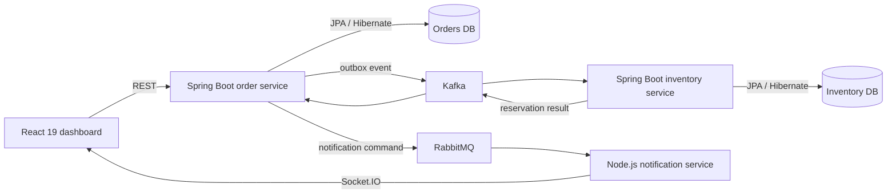

# FulfillX

**An event-driven order and inventory platform built to demonstrate production-oriented full-stack engineering.**

FulfillX accepts orders through a React operations dashboard, persists them with Spring Data JPA/Hibernate, coordinates inventory through Kafka, dispatches notification commands through RabbitMQ, and streams outcomes from a Node.js service to the browser in real time.

## What makes this more than CRUD

- Transactional outbox prevents a committed order from losing its integration event.
- Idempotent Kafka consumption prevents duplicate inventory reservations.
- Optimistic locking protects stock during concurrent orders.
- Explicit order state transitions protect domain invariants.
- Strategy-based fulfillment cleanly selects standard or priority behavior.
- RabbitMQ acknowledgement/retry semantics isolate notification work.
- Structured JSON logs and correlation IDs make requests traceable across services.
- Playwright covers the full workflow on Chromium, Firefox, and WebKit; Selenium provides a compatibility smoke suite.

## Architecture



See [the architecture notes](docs/architecture.md) for patterns, failure scenarios, and design decisions.

## Technology stack

| Layer | Technology |
| --- | --- |
| Frontend | React 19, TypeScript, Vite, Socket.IO client |
| Java backend | Java 17, Spring Boot 4, Spring MVC, Spring Data JPA, Hibernate |
| Node backend | Node.js 24 LTS, Express 5, Socket.IO, Pino |
| Data | PostgreSQL 17, database-per-service ownership |
| Messaging | Apache Kafka for domain events, RabbitMQ for work commands |
| Quality | JUnit 5, AssertJ, Vitest, Playwright, Selenium WebDriver |
| Operations | Docker Compose, Spring Actuator, structured logs, GitHub Actions |

> Hibernate is an ORM, not a database. PostgreSQL is the database; Hibernate maps Java domain objects to its relational tables.

## Run the complete platform

### Requirements

- Docker with Docker Compose
- At least 4 GB of memory available to Docker

```bash
cp .env.example .env
# Add unique local values for POSTGRES_PASSWORD and RABBITMQ_PASSWORD.
docker compose up --build
```

Open:

- Dashboard: <http://localhost:3000>
- Order API: <http://localhost:8080/api/orders>
- Inventory API: <http://localhost:8081/api/inventory>
- Notification API: <http://localhost:3001/api/notifications>
- RabbitMQ management: <http://localhost:15672> (use the credentials configured in `.env`)

Stop the platform without deleting its database volume:

```bash
docker compose down
```

To intentionally reset all demo data:

```bash
docker compose down --volumes
```

## Try the API

```bash
curl -X POST http://localhost:8080/api/orders \
  -H 'Content-Type: application/json' \
  -H 'X-Correlation-ID: demo-001' \
  -d '{
    "customerEmail": "buyer@example.com",
    "sku": "LAPTOP-PRO",
    "quantity": 1,
    "unitPrice": 1499.00,
    "priority": true
  }'
```

The initial response is pending. Within a few seconds, Kafka carries the event to inventory, the result returns to the order service, and the dashboard updates to `CONFIRMED` or `REJECTED`.

## Tests

### Java unit tests

```bash
./mvnw test
```

### Node tests

```bash
cd services/notification-service
npm ci
npm test
```

### Playwright end-to-end tests

Run the Docker stack first, then:

```bash
cd qa
npm ci
npx playwright install
npm run test:e2e
```

### Selenium smoke test

With Chrome installed and the stack running:

```bash
cd qa
npm run test:selenium
```

Playwright is the primary E2E framework because its auto-waiting, trace viewer, isolation, and cross-browser projects make it well suited to modern UI testing. Selenium remains valuable for broad WebDriver/Grid compatibility and demonstrates both approaches without duplicating the entire suite.

## API overview

| Method | Endpoint | Purpose |
| --- | --- | --- |
| `POST` | `/api/orders` | Validate and place an order |
| `GET` | `/api/orders` | List orders and current states |
| `GET` | `/api/inventory` | List available and reserved stock |
| `GET` | `/api/notifications` | List recent notification outcomes |
| `GET` | `/actuator/health` | Spring service health |
| `GET` | `/health` | Node service health |

## Scenario-based design discussion

**Why not make everything synchronous?** A synchronous chain makes order creation dependent on inventory and notification uptime. Domain events reduce temporal coupling and allow consumers to scale separately.

**Why Kafka plus RabbitMQ?** Kafka is used for replayable facts such as `order.created`; RabbitMQ is used for commands that should be processed and acknowledged once. They solve different problems.

**Where does ActiveMQ fit?** It is intentionally not running beside RabbitMQ. An `ActiveMqNotificationAdapter` can replace the RabbitMQ adapter when JMS interoperability is required. Adding a third broker without a distinct workload would weaken rather than strengthen the architecture.

**How is overselling prevented?** Inventory entities use optimistic versioning. Concurrent updates cannot silently overwrite each other; failed transactions can be retried with a bounded policy in a production extension.

**What would come next in production?** OAuth2/OIDC, schema registry, dead-letter queues, inventory-service outbox, OpenTelemetry, Flyway migrations, Kubernetes, rate limiting, and contract tests.

## Repository structure

```text
fulfillx/
├── frontend/                       React operations dashboard
├── services/
│   ├── order-service/              Spring MVC + outbox + order domain
│   ├── inventory-service/          Spring MVC + idempotent reservations
│   └── notification-service/       Node.js + RabbitMQ + Socket.IO
├── qa/                             Playwright and Selenium suites
├── infra/postgres/                 Local database initialization
├── docs/                           Architecture decisions
├── .github/workflows/              Continuous integration
└── docker-compose.yml              Complete local environment
```

## Suggested resume bullets

- Built an event-driven order fulfillment platform using React, Spring Boot, Node.js, PostgreSQL, Kafka, and RabbitMQ, separating order, inventory, and notification workloads across independently deployable services.
- Implemented transactional outbox, idempotent consumers, optimistic locking, Strategy-based fulfillment, structured logging, and correlation IDs to improve message reliability, concurrency safety, and observability.
- Automated unit and cross-browser workflows with JUnit, Vitest, Playwright, Selenium, Docker Compose, and GitHub Actions.

## License

MIT — see [LICENSE](LICENSE).
