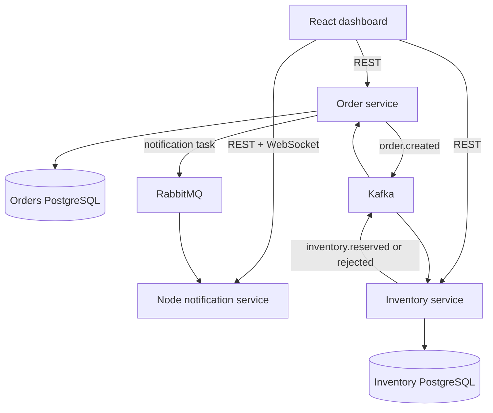

# FulfillX Architecture

FulfillX is a small event-driven order-fulfillment platform designed to demonstrate production-oriented full-stack engineering without hiding business rules inside framework code.

## Why both Kafka and RabbitMQ?

- **Kafka** stores replayable domain events and decouples the order and inventory bounded contexts.
- **RabbitMQ** handles disposable work commands for notifications, where acknowledgement and retry semantics matter more than replay.
- **ActiveMQ is not active in the MVP.** The notification boundary is broker-agnostic and an ActiveMQ adapter is a documented extension. Running three brokers for one workflow would add infrastructure without adding meaningful behavior.

## Patterns demonstrated

| Pattern | Location | Reason |
| --- | --- | --- |
| Aggregate | `Order`, `InventoryItem` | Protect business invariants inside domain objects |
| Strategy | `FulfillmentPolicy` | Select standard or priority fulfillment behavior |
| Transactional outbox | Order service | Avoid losing `order.created` after a database commit |
| Repository | Spring Data repositories | Separate persistence from domain behavior |
| Observer / pub-sub | Kafka consumers | React to cross-service domain events |
| Competing consumer | RabbitMQ queue | Scale notification workers independently |
| Optimistic locking | Inventory `@Version` | Prevent overselling under concurrent requests |
| Idempotent consumer | `ProcessedEvent` | Ignore duplicate Kafka deliveries |

## Main scenario

1. A user submits an order through the React dashboard.
2. The order service validates the request, saves the order and an outbox record in one database transaction.
3. The outbox publisher sends `order.created` to Kafka.
4. The inventory service consumes the event, performs an optimistic-lock reservation and emits a result.
5. The order service updates the order state and sends a notification command to RabbitMQ.
6. The Node.js service acknowledges the command and pushes it to connected browsers through Socket.IO.

## Failure scenarios

- A Kafka publish failure leaves the outbox row pending for retry.
- Duplicate order events are ignored by the inventory service.
- Insufficient stock produces a rejection event instead of a partial reservation.
- A notification worker crash before acknowledgement causes RabbitMQ to redeliver the command.
- Correlation IDs are accepted from `X-Correlation-ID` or generated at the HTTP boundary and included in structured logs.

